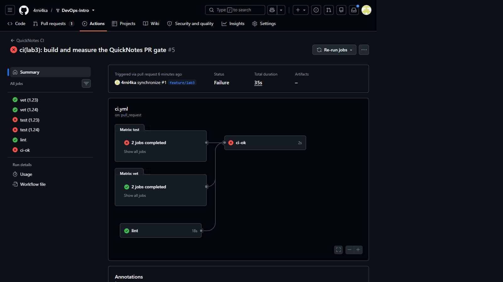
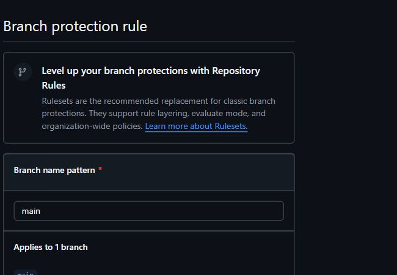

# Lab 3 — CI/CD: A PR-Gated Pipeline for QuickNotes

## Chosen path

I used **GitHub Actions** because the repository and pull-request workflow are on GitHub. The workflow is in `.github/workflows/ci.yml`.

## Task 1 — PR gate

The pipeline runs on pushes to `main` and pull requests targeting `main`. It has independent `vet`, `test`, and `lint` jobs, and a single `ci-ok` aggregation job used by branch protection. The runner is pinned to `ubuntu-24.04`; all actions are pinned to full commit SHAs; workflow permissions are limited to `contents: read`; and golangci-lint is pinned to v2.5.0.

- Green run after repairing the deliberately broken test: [QuickNotes CI run 35266870944](https://github.com/4rni4ka/DevOps-Intro/actions/runs/35266870944)
- Deliberately failed run: [QuickNotes CI run 35266765581](https://github.com/4rni4ka/DevOps-Intro/actions/runs/35266765581)
- Failure commit: [`78f6336`](https://github.com/4rni4ka/DevOps-Intro/commit/78f633606869fd85d16b73b5fca756a8f003b8ba)
- Repair commit: [`8eda394`](https://github.com/4rni4ka/DevOps-Intro/commit/8eda3940d9bb843bbba032366afbb47a7365a424)

The failure changed the expected status in `TestCreateNote_RoundTrip`. Both Go matrix test jobs failed and the aggregate `ci-ok` check failed. GitHub reported the pull request as `UNSTABLE`, so it was not eligible to merge with the required check.

Branch protection on the fork's `main` requires a pull request, an up-to-date branch, signed commits, linear history, and the `ci-ok` status check. The rule also applies to administrators.

### Design questions

**a) Why pin `ubuntu-24.04` instead of `ubuntu-latest`?**  
`ubuntu-latest` is a moving label. When GitHub changes the image behind it, tool versions, preinstalled packages, system libraries, or defaults can change without a repository commit. Pinning the LTS image makes the execution environment predictable and turns an image upgrade into a deliberate change that can be reviewed and tested.

**b) Why split vet, test, and lint?**  
Separate jobs run concurrently and identify the failing class of check immediately. A combined job is normally sequential, stops at the first failure, hides later failures, and makes it harder to compare timings or retry only the affected work. The aggregate job preserves a stable branch-protection check while the internal matrix changes.

**c) What attack does SHA pinning prevent?**  
It prevents a mutable tag from being retargeted to attacker-controlled code. In the **tj-actions/changed-files supply-chain compromise (CVE-2025-30066), active 14–15 March 2025**, attackers moved version tags to a malicious commit that exposed runner secrets in logs. A reviewed 40-character commit SHA cannot silently move with the tag. Source: [GitHub Advisory Database](https://github.com/advisories/ghsa-mrrh-fwg8-r2c3).

**d) What is `permissions:` and what principle is behind it?**  
It controls what the workflow's temporary `GITHUB_TOKEN` may do. `contents: read` is sufficient for checkout and analysis, so the jobs cannot write repository contents, issues, or pull requests. This follows the principle of least privilege: grant only the capability needed for the current operation.

**e) Stage versus job in GitLab, and `dependencies:` versus `stages:`?**  
This submission uses GitHub Actions, but in GitLab a job is one executable unit, while a stage groups jobs that may run in parallel and orders groups of work. `stages:` defines that high-level order. `dependencies:` controls which earlier jobs' artifacts a job downloads; it does not establish the stage sequence by itself.

## Task 2 — Fast and smart

### Measurements

Times are wall-clock values from the GitHub Actions run summary. QuickNotes has no third-party Go modules, so cache results are intentionally modest and runner allocation dominates some runs.

| Scenario | Run | Wall-clock |
|---|---|---:|
| Baseline: no cache, one Go version, no path filter | [35266037230](https://github.com/4rni4ka/DevOps-Intro/actions/runs/35266037230) | 65 s |
| Cache enabled, one Go version | [35266232925](https://github.com/4rni4ka/DevOps-Intro/actions/runs/35266232925) | 31 s |
| Cache + Go 1.23/1.24 matrix | [35266656130](https://github.com/4rni4ka/DevOps-Intro/actions/runs/35266656130) | 38 s |

The baseline's individual job durations were 17 s (`vet`), 26 s (`test`), and 25 s (`lint`), but runner allocation delayed two jobs by about 38 seconds. In the cached run the Go setup steps took about 1–3 seconds, while the actual lint, vet, and test steps took 17, 20, and 22 seconds. The cache cannot eliminate runner provisioning, checkout, toolchain setup, or race-detector compilation, and there is no `go.sum` dependency graph to download.

### Optimizations applied

1. `actions/setup-go` caches the module and Go build caches, keyed from `app/go.mod` because this zero-dependency module has no `go.sum` yet.
2. `vet` and `test` use a parallel Go 1.23/1.24 matrix with `fail-fast: false`.
3. Event path filters run CI only for `app/**` and `.github/workflows/ci.yml`; [documentation-only PR #2](https://github.com/4rni4ka/DevOps-Intro/pull/2) reports no checks, demonstrating the skip.
4. Branch protection requires only `ci-ok`, so matrix check names can evolve without leaving obsolete required checks pending.

### Task 2 design questions

**f) Why cache inputs keyed by dependency metadata rather than treating generated outputs as authoritative?**  
Dependency metadata is reviewed, deterministic input. If `go.sum` changes, the key changes and stale dependencies are not reused. Build outputs depend on the toolchain, OS, architecture, build flags, environment, and sometimes source-control metadata; treating them as portable authoritative results risks subtle stale or incompatible artifacts. A cache must remain disposable: a clean run should always be able to regenerate it.

**g) What does `fail-fast: false` change?**  
All matrix cells finish even after one cell fails, so the result shows whether the defect is version-specific or universal. `fail-fast: true` is useful when later cells are expensive and the first failure already invalidates the whole experiment, for example a large integration matrix where rapid cancellation saves substantial compute.

**h) What is the cache-poisoning risk?**  
An attacker who can save executable or compiler-consumed files under a key later restored by a trusted workflow may obtain code execution with the trusted workflow's permissions or secrets. GitHub isolates pull-request caches under the PR merge ref, so the base branch and sibling PRs cannot restore them; low-trust default-branch-context triggers are also read-only unless cache write access is explicitly enabled. Cache contents should still be treated as untrusted, contain no secrets, use narrow dependency-derived keys, and be written from trusted triggers. Source: [GitHub dependency-caching security reference](https://docs.github.com/en/actions/reference/workflows-and-actions/dependency-caching#cache-access-for-low-trust-workflow-triggers).

## Bonus — Pipeline performance investigation

### Profile

| Unit | Runner start | Dependency/tool setup | Actual work | Cleanup |
|---|---:|---:|---:|---:|
| vet | 2–3 s normally; one baseline allocation waited ~3 s | 0–8 s | 11–20 s | 1–2 s |
| test | 2–3 s normally; baseline allocation waited ~38 s | 1–8 s | 17–22 s | 1–2 s |
| lint | 2–3 s normally; baseline allocation waited ~39 s | 0–1 s plus action preparation | 17–22 s | 1–2 s |
| ci-ok | ~2 s | none | <1 s | <1 s |

### Additional optimizations beyond Task 2

- The three analysis units are independent and run in parallel; `ci-ok` is the only downstream dependency.
- The pinned golangci-lint action obtains a versioned binary instead of compiling the linter with `go install` on every run.
- `GOFLAGS=-buildvcs=false` avoids source-control metadata probing in shallow CI clones.

| Optimization applied | Before | After | Observed effect |
|---|---:|---:|---:|
| Parallel vet/test/lint | 68 s sum of measured baseline job durations | 26 s longest job | 42 s shorter critical path before runner queueing |
| Pinned prebuilt linter action | source build intentionally avoided | 20 s baseline lint step | removes an otherwise repeated source build; isolated saving not measured |
| `GOFLAGS=-buildvcs=false` | cached single-version run: 31 s | final matrix run: 38 s | effect is below runner/matrix variance and was not isolated |
| **Total wall-clock** | **65 s baseline** | **38 s cache + matrix** | **27 s faster while doubling vet/test coverage** |

The pipeline is below the 90-second target. The remaining critical path is usually `go test -race`, because the race-enabled test binary must be compiled and run for both toolchains; on a cold Go 1.23 runner, toolchain/cache setup also contributes. QuickNotes could reduce that time by splitting pure unit tests from slower integration tests and keeping expensive fixtures out of the per-commit suite, while retaining the full race suite for protected branches. With the current small codebase, further pipeline-only tuning would mostly chase hosted-runner variance rather than meaningful work. I would stop optimizing around 45–60 seconds because feedback is already fast enough for normal pull-request iteration and the maintenance cost of a custom image or self-hosted runner would exceed the saved seconds.

