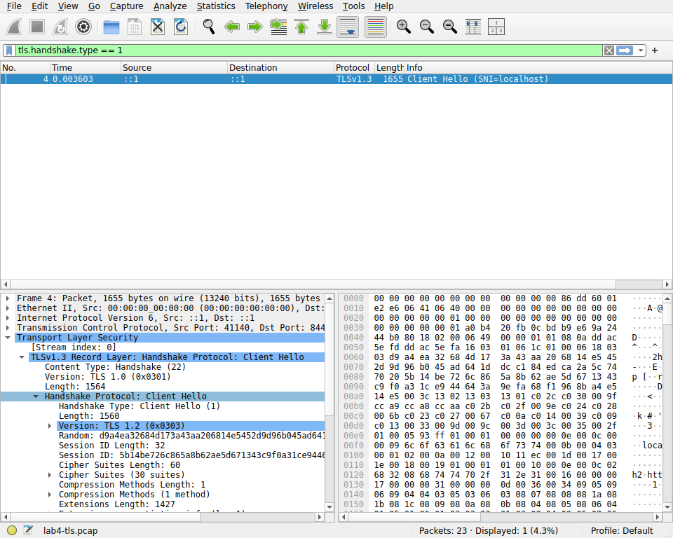
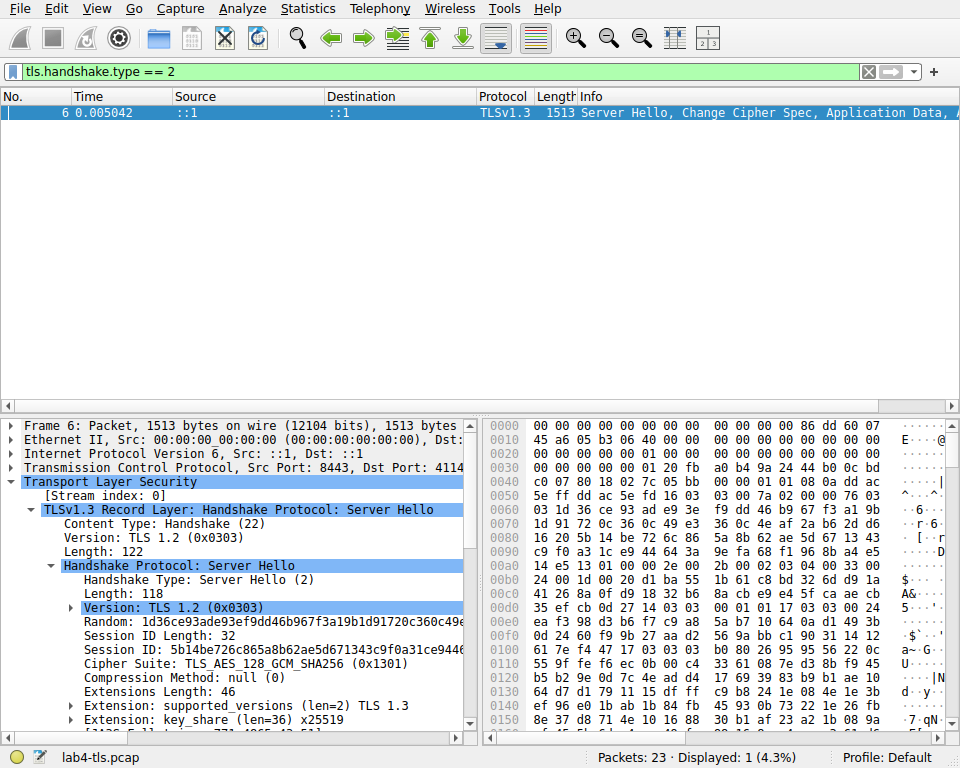
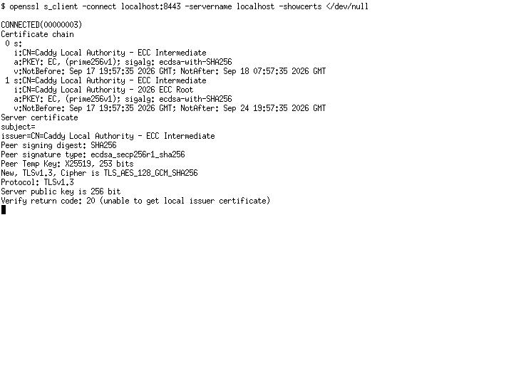

# Lab 4 — OS & Networking: Trace, Debug, and Read the Substrate

Environment: Ubuntu 26.04 under WSL2, Go 1.26.0, tcpdump 4.99.6, and Wireshark/TShark 4.6.4. QuickNotes itself remains compatible with the module version declared in the repository.

## Task 1 — Trace one request end to end

I captured one IPv6 loopback connection from `[::1]:55402` to `[::1]:8080`. The reusable packet capture is [`lab4-trace.pcap`](evidence/lab4-trace.pcap), and the complete human-readable trace with labels is [`lab4-trace.txt`](evidence/lab4-trace.txt).

### Annotated packet sequence

| Time | Direction | TCP/HTTP | Interpretation |
|---|---|---|---|
| 00:55:09.190530 | client → server | `[S]`, seq 3073813130 | SYN starts the TCP handshake. |
| 00:55:09.190568 | server → client | `[S.]`, seq 3103313443, ack 3073813131 | SYN/ACK accepts and acknowledges the connection. |
| 00:55:09.190580 | client → server | `[.]`, ack 1 | Final ACK completes the three-way handshake. |
| 00:55:09.190736 | client → server | `[P.]`, 175 bytes | `POST /notes HTTP/1.1` plus `{"title":"trace me","body":"in flight"}`. |
| 00:55:09.192187 | server → client | `[P.]`, 206 bytes | `HTTP/1.1 201 Created` plus the created-note JSON. |
| 00:55:09.193332 | client → server | `[F.]` | Client begins an orderly close. |
| 00:55:09.193743 | server → client | `[F.]` | Server acknowledges and closes its direction. |
| 00:55:09.193814 | client → server | `[.]` | Final ACK completes the close. |

The capture contains 10 packets with no kernel drops. The request and response payloads are visible because this first capture is plain HTTP.

### Five debugging commands

The complete unabridged session is in [`lab4-debug-session.txt`](evidence/lab4-debug-session.txt).

1. **What is listening?**

   ```text
   $ ss -tlnp | grep :8080
   LISTEN 0 4096 *:8080 *:* users:(("quicknotes",pid=733,fd=3))
   ```

   Decision: a QuickNotes process owns a TCP listening socket on all local addresses at port 8080.

2. **What routes exist?**

   ```text
   $ ip route show
   default via 172.26.112.1 dev eth0 proto kernel
   172.17.0.0/16 dev docker0 proto kernel scope link src 172.17.0.1 linkdown
   172.26.112.0/20 dev eth0 proto kernel scope link src 172.26.123.241
   ```

   Decision: remote traffic uses the WSL gateway on `eth0`; Docker has a separate, currently down bridge route. Loopback traffic does not require either route.

3. **Is localhost reachable?**

   ```text
   $ mtr -rwc 5 localhost
   HOST: WIN-NCH2CQLTP9J Loss% Snt Last Avg Best Wrst StDev
     1.|-- localhost        0.0%   5  0.1 0.1  0.1  0.4  0.2
   ```

   Decision: the loopback path is one hop with zero loss and sub-millisecond latency.

4. **Does external DNS work?**

   ```text
   $ dig +short example.com @1.1.1.1
   104.20.23.154
   172.66.147.243
   ```

   Decision: a direct query to the specified resolver succeeds and returns two A records.

5. **Are there user-service logs?**

   ```text
   $ journalctl --user -u quicknotes -n 20 || true
   -- No entries --
   ```

   Decision: this run was a foreground process rather than a user systemd service, so the unit has no journal entries. The application log must be read from its captured standard output instead.

### If QuickNotes returned 502

I would start at the component that generated the 502, usually the reverse proxy, and check its error log for the upstream address and failure type. Then I would move inward: resolve the upstream name, confirm the expected process is running, verify the listening address with `ss -tlnp`, and call `/health` directly from the proxy host with `curl -v`. A direct 200 but proxied 502 points toward proxy routing, protocol, timeout, or TLS configuration; a refused direct connection points toward process startup or an incorrect port; a timeout points toward routing or firewall rules. I would also correlate timestamps in the proxy and QuickNotes logs before changing anything.

## Task 2 — Outside-in debugging on a broken deploy

### Reproduced failure

With one instance already listening on 8080, the second command failed exactly as follows:

```text
$ ADDR=:8080 go run .
2026/09/18 00:56:23 quicknotes listening on :8080 (notes loaded: 4)
2026/09/18 00:56:23 listen: listen tcp :8080: bind: address already in use
exit status 1
```

Root cause: two processes were configured to bind the same local address and TCP port. Only the first listener could own `:8080`.

### Outside-in chain

1. **Process state**

   ```text
   $ ps -ef | grep quicknotes | grep -v grep
   root 733 588 0 00:56 pts/0 00:00:00 /tmp/quicknotes-lab4-debug.WqMmnP/quicknotes
   ```

   Decision: one QuickNotes process remains alive; the failed second launch is absent.

2. **Listening socket**

   ```text
   $ ss -tlnp | grep 8080
   LISTEN 0 4096 *:8080 *:* users:(("quicknotes",pid=733,fd=3))
   ```

   Decision: PID 733 owns the contested port, confirming the bind error is not a firewall or application-route issue.

3. **Host reachability**

   ```text
   $ curl -s -o /dev/null -w "%{http_code}\n" http://localhost:8080/health
   200
   ```

   Decision: the surviving first process is reachable and healthy. The deployment failure affected the replacement process, not current service availability.

4. **Firewall**

   ```text
   $ iptables -L -n -v
   Chain INPUT (policy ACCEPT 0 packets, 0 bytes)
   Chain FORWARD (policy ACCEPT 0 packets, 0 bytes)
   Chain OUTPUT (policy ACCEPT 0 packets, 0 bytes)
   ```

   Docker-specific chains were present, but there was no rule rejecting loopback port 8080. Decision: the firewall is not the root cause.

5. **DNS**

   ```text
   $ dig +short localhost
   127.0.0.1
   ```

   Decision: `localhost` resolves correctly. The HTTP capture used IPv6 `::1`, while this DNS answer displays IPv4; QuickNotes listened on both through `*:8080`.

### Repair and verification

```text
$ kill $PID1
$ ADDR=:8080 quicknotes &
$ curl -s http://localhost:8080/health
{"notes":4,"status":"ok"}

$ ss -tlnp | grep 8080
LISTEN 0 4096 *:8080 *:* users:(("quicknotes",pid=825,fd=3))
```

The old listener was stopped before the replacement started. The new process acquired port 8080 and returned a healthy response.

### Mini-postmortem

The failed replacement was caused by a deployment procedure that allowed two instances with an exclusive host-port binding to overlap. No individual action was unreasonable: the old process was kept alive to preserve availability, while the new process used the configured default port. The systemic gap was the absence of an orchestrated handoff, preflight port check, and readiness-controlled cutover. A systemd unit with explicit restart semantics, socket activation, or a reverse proxy routing to versioned backend ports would make the transition deterministic. CI or deployment scripts should also check configuration uniqueness, run `ss` before launch, fail clearly on bind errors, and verify `/health` before declaring success. Rollback should stop only the failed candidate and keep the known-good listener serving traffic.

## Bonus — TLS handshake

Caddy terminated TLS on `localhost:8443` and proxied to QuickNotes on `127.0.0.1:8080`. The configuration is in [`Caddyfile.lab4`](evidence/Caddyfile.lab4), the packet capture is [`lab4-tls.pcap`](evidence/lab4-tls.pcap), the concise decode is [`lab4-tls-summary.txt`](evidence/lab4-tls-summary.txt), and the full handshake decode is [`lab4-tls-handshake.txt`](evidence/lab4-tls-handshake.txt).

### ClientHello

Frame 4 is a ClientHello from `[::1]:41140` to `[::1]:8443`. Its legacy version field is `0x0303`, while the `supported_versions` extension offers `0x0304` (TLS 1.3) and `0x0303` (TLS 1.2). It sends SNI `localhost` and offers 30 cipher suites, including TLS 1.3 suites `0x1301`, `0x1302`, and `0x1303`.



### ServerHello

Frame 6 is the ServerHello. The `supported_versions` extension selects `0x0304` (TLS 1.3), and the chosen cipher is `0x1301`, `TLS_AES_128_GCM_SHA256`.



**TLS 1.0/1.1 exclusion:** version negotiation removes them before application data exists. This ClientHello does not offer them in `supported_versions`, and the ServerHello selects TLS 1.3 from the client/server intersection. The `0x0303` record/legacy-version field is retained for compatibility and does not mean the negotiated protocol is TLS 1.2.

### Certificate chain

`openssl s_client` shows a short-lived localhost leaf issued by `Caddy Local Authority - ECC Intermediate`, followed by that intermediate issued by `Caddy Local Authority - 2026 ECC Root`. The local root was intentionally not installed into the trust store, so verification code 20 is expected for this isolated exercise. The complete output is in [`lab4-cert-chain.txt`](evidence/lab4-cert-chain.txt).



The connection negotiated TLS 1.3, `TLS_AES_128_GCM_SHA256`, X25519 key exchange, and an ECDSA P-256 certificate chain.
